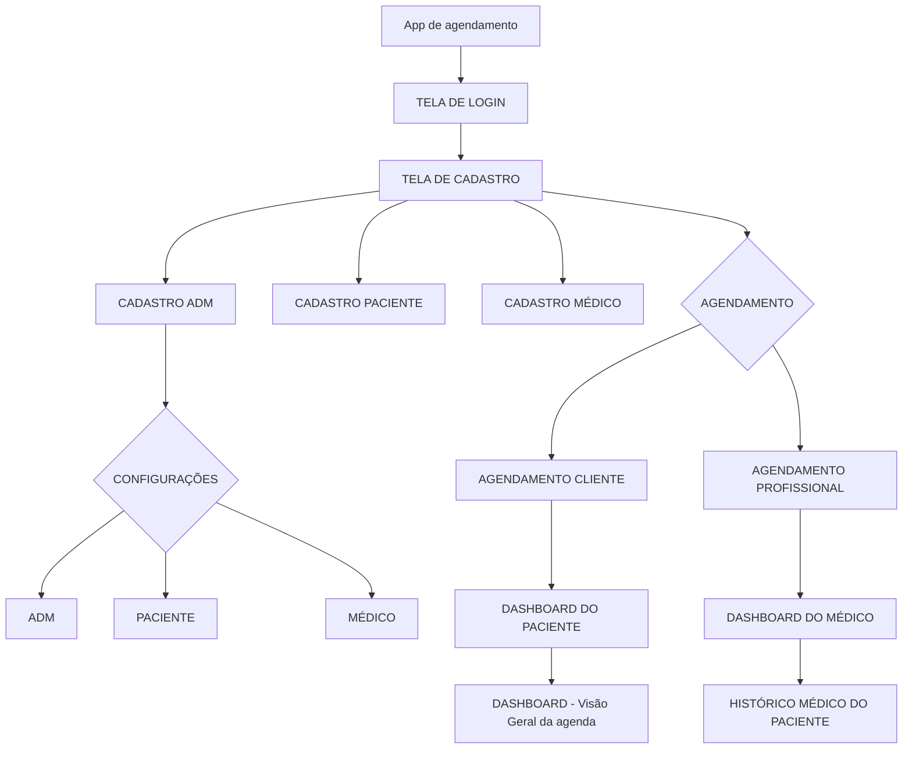

# Sistema de Agendamentos - Clínica

## Descrição
Este é um sistema de gerenciamento de agendamentos para clínica médica, desenvolvido em Python utilizando a biblioteca CustomTkinter para a interface gráfica. O sistema permite o gerenciamento de consultas, cadastro de pacientes e médicos, e controle de agendamentos.

## Fluxograma do Sistema
O sistema segue o seguinte fluxo de funcionamento:



## Funcionalidades
- Sistema de login seguro
- Cadastro de pacientes
- Cadastro de médicos
- Agendamento de consultas
- Interface gráfica moderna com tema escuro
- Sistema de banco de dados SQLite

## Requisitos do Sistema
- Python 3.x
- CustomTkinter
- Tkinter
- SQLite3
- pytest (para testes)
- pyinstaller (para criar executável)

## Estrutura do Projeto
```
Projeto_Clinica/
├── main.py              # Arquivo principal de execução
├── banco_dados.py       # Gerenciamento do banco de dados
├── clinica.db          # Banco de dados SQLite
├── ui/                 # Pasta com arquivos da interface
│   ├── tela_login.py    # Tela de login
│   ├── tela_cadastro.py # Tela de cadastro
│   ├── tela_medico.py   # Tela de gerenciamento de médicos
│   └── tela_agendamento.py # Tela de agendamentos
```

## Como Instalar
1. Clone o repositório
2. Crie um ambiente virtual:
   ```
   python -m venv .venv
   ```
3. Ative o ambiente virtual:
   - Windows: `.venv\Scripts\activate`
   - Linux/Mac: `source .venv/bin/activate`
4. Instale as dependências:
   ```
   pip install -r requirements.txt
   ```

## Como Executar
1. Ative o ambiente virtual
2. Execute o arquivo principal:
   ```
   python main.py
   ```

## Como Criar o Executável
1. Certifique-se de que todas as dependências estão instaladas:
   ```
   pip install -r requirements.txt
   ```
2. Execute o comando para criar o executável:
   ```
   pyinstaller --onefile --windowed --icon=ui/icon.ico main.py
   ```
3. O executável será criado na pasta `dist/`
4. Para distribuir o programa, você precisará:
   - O arquivo executável gerado na pasta `dist/`
   - O arquivo `clinica.db` (banco de dados)
   - Coloque ambos os arquivos na mesma pasta

## Funcionalidades por Tela

### Tela de Login
- Autenticação de usuários
- Interface com tema escuro
- Opção para cadastro de novos usuários

### Tela de Cadastro
- Cadastro de novos pacientes
- Validação de dados
- Interface intuitiva

### Tela de Médico
- Gerenciamento de profissionais
- Cadastro de especialidades
- Visualização de agenda

### Tela de Agendamento
- Marcação de consultas
- Seleção de médico e horário
- Visualização de disponibilidade

## Banco de Dados
O sistema utiliza SQLite como banco de dados, armazenando informações em `clinica.db`. As principais tabelas incluem:
- Pacientes
- Médicos
- Agendamentos
- Usuários

## Testes
O projeto inclui testes unitários utilizando pytest. Para executar os testes:
```
pytest
```

## Contribuição
Para contribuir com o projeto:
1. Faça um fork do repositório
2. Crie uma branch para sua feature
3. Faça commit das mudanças
4. Envie um pull request

## Licença
Este projeto está sob a licença MIT.
